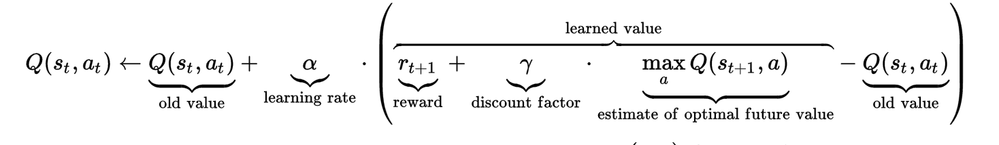

## OpenAI Taxi-v2 game using Q learning


Q-learning is an off policy reinforcement learning algorithm that seeks to find the best action to take given the current state. In this project Q learning technique has been applied over OpenAI Taxi-v2 game.

In order to update Q values, we will use the following action-value function:



In this game we have 6 actions:
* down (south)
* up (north)
* right (east)
* left (west)
* picking up
* dropping off

Secondly, we should define our states. We have 5*5 cells 
which means we have at least 25 states. The taxi can be 
also in a state of picking up or dropping off the 
passenger. Then we have 4 more states. Finally, we have to compute those states where the passenger is actually picked up, dropped off (+ 4 states, since the locations where the passenger could be are 4) or simply transported (+ 1 state). So, in total, we have 5x5x4x5=500 states.

Each state of our agent is actually encoded within value 0 and 499. We should also take rewards into account. There are different rewards depending on action that agent makes:

* if the taxi correctly pick-up/drop-off the passenger, it is rewarded with +20 points

* if the taxi does an illegal pick-up/drop-off, it is punished with -10 points

* for each step which does not include the states above, it loses 1 point

An agent interacts with the environment in 1 of 2 ways. 
The first is to use the q-table as a reference and view 
all possible actions for a given state. The agent then 
selects the action based on the max value of those 
actions. This is known as **exploiting** since we use the 
information we have available to us to make a decision.

The second way to take action is to act randomly. This 
is called **exploring**. Instead of selecting actions based 
on the max future reward we select an action at random. 
Acting randomly is important because it allows the agent 
to explore and discover new states that otherwise may 
not be selected during the exploitation process. You can 
balance exploration/exploitation using epsilon (ε) and 
setting the value of how often you want to explore vs 
exploit. Here’s some rough code that will depend on how 
the state and action space are setup.

You can launch game and see optimal converged Q table, the steps that has been taken to reach the goal:

```sh
$ python3 game.py
```


